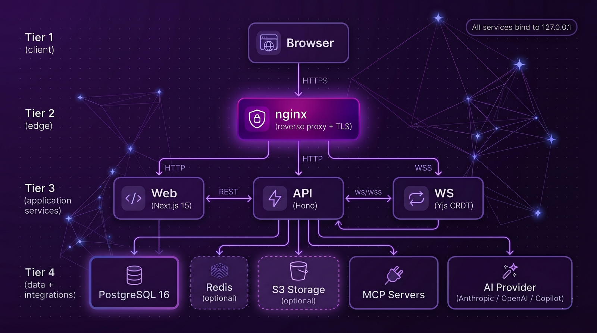

<p align="center">
  
</p>

<h1 align="center">Doable</h1>

<p align="center">
  <strong>Dream it. Do it. Done.</strong>
</p>

<p align="center">
  The open source AI app builder. Describe what you want and Doable builds it, deploys it, and hosts it.
</p>

<p align="center">
  
</p>

## Get Started

Choose your path:

```bash
# Try it locally in 60 seconds (Docker, no domain, no API keys required to boot)
git clone https://github.com/doable-me/doable.git && cd doable && ./deployment/docker/setup.sh

# Local dev (Node 22, pnpm, Postgres 16)
pnpm install && cp .env.example .env && pnpm db:migrate && pnpm dev

# Production VPS (Ubuntu 22.04/24.04 with a Cloudflare managed domain)
./deployment/server-setup.sh
```

### After first launch

Open http://localhost:3000, sign up. The first account becomes the platform owner automatically. You'll be guided through a 5 step setup wizard for AI keys and integrations. No SSH, no SQL, no editing .env files.

---

## Deploy in one click

Doable ships with manifests for every major full-stack PaaS. Pick the one that matches where you already host things — the same prebuilt images from `ghcr.io/doable-me/doable-*` back every path, so the deploy is ~30s once secrets are filled in.

[](https://cloud.digitalocean.com/apps/new?repo=https://github.com/doable-me/doable/tree/main)
[](https://render.com/deploy?repo=https://github.com/doable-me/doable)
[](https://railway.com/new/template?template=https://github.com/doable-me/doable)
[](https://heroku.com/deploy?template=https://github.com/doable-me/doable)
[](https://codespaces.new/doable-me/doable?quickstart=1)

| Platform | Path | Manifest |
|---|---|---|
| **Coolify** (self-hosted) | Point at `deployment/docker/docker-compose.prod.yml` | [`deployment/docker/coolify.md`](deployment/docker/coolify.md) |
| **DigitalOcean App Platform** | 1-click button above | [`.do/app.yaml`](.do/app.yaml) |
| **Render** | 1-click button above | [`render.yaml`](render.yaml) |
| **Railway** | 1-click button above | [`railway.json`](railway.json) |
| **Fly.io** | `bash deployment/platforms/fly/migrate.sh` then `fly deploy` per app | [`deployment/platforms/fly/DEPLOY.md`](deployment/platforms/fly/DEPLOY.md) |
| **Kubernetes** | `kubectl apply -k deployment/platforms/k8s/base/` | [`deployment/platforms/k8s/README.md`](deployment/platforms/k8s/README.md) |
| **Heroku** | 1-click button above | [`app.json`](app.json) |
| **GitHub Codespaces** | 1-click button above | [`.devcontainer/devcontainer.json`](.devcontainer/devcontainer.json) |

---

## Badges

[](LICENSE)
[](https://github.com/doable-me/doable/stargazers)
[](https://discord.gg/doable)

---

## Why Doable?

Most AI coding tools generate code but leave you to wire it all up yourself. Doable is a **complete platform** where you describe an idea and get a working, deployed app. No terminal. No config files. No boilerplate.

| Without Doable | With Doable |
|----------------|-------------|
| Juggle 5 tools to scaffold a project | Describe it in one message |
| Manually set up databases | AI provisions Supabase in one click |
| Wire up auth, APIs, hosting yourself | Everything connected out of the box |
| Export code and figure out deployment | Publish to a live URL instantly |
| Limited to one AI model | 60+ providers, use any model you want |

**Doable is for creators, designers, founders, and teams.** If you can describe it, Doable can build it.

---

## Features

### Team Collaboration

Multiple users can work together in real time on the same project. Chat together, co design together, code together.

- **Multi user chat** where the whole team talks to the AI and to each other in the same conversation
- **Real time co editing** of code and design simultaneously (powered by Yjs CRDT)
- **Visual co design** where anyone can click elements on the live preview and describe changes visually
- **Customized workspaces** where each project or team gets its own space with tailored AI behavior, custom skills, custom MCP servers, and per workspace configurations so the AI acts differently depending on the context

### AI Powered Development

- **Natural language to working app** in one conversation
- **60+ AI providers** including Anthropic Claude, OpenAI, Google Gemini, Groq, Mistral, DeepSeek, local models via Ollama/LM Studio, and [many more](#supported-ai-providers)
- **File builders** to generate presentations (PPTX), spreadsheets (XLSX), PDFs, and Markdown directly from chat
- **One click Supabase** where AI provisions a database, runs migrations, and deploys edge functions with zero config

### Integrations (powered by ActivePieces)

50+ integrations out of the box. Connect services and the AI uses them as tools automatically:

| Category | Examples |
|----------|----------|
| **Developer Tools** | GitHub, GitLab, Linear, Jira, Sentry, Vercel, Netlify |
| **Communication** | Slack, Discord, Telegram, Microsoft Teams |
| **Productivity** | Notion, Google Workspace, Airtable, Asana, Trello |
| **Finance** | Stripe, PayPal, Shopify, QuickBooks |
| **Database** | Supabase (first class, one click provisioning) |
| **AI/ML** | OpenAI, Replicate, Hugging Face |

### Air Gapped and Local Deployment

Doable itself (minus third party integrations) can be deployed and used completely air gapped. Run it locally with local models within your intranet where security and data residency require it.

```bash
# Private network / air gapped
HOST=192.168.1.50 ./deployment/docker/setup.sh
```

Uses self signed SSL. All services stay on `127.0.0.1`. Point it at Ollama, LM Studio, vLLM, or any local model server and you have a fully private AI app builder with zero internet dependency.

### Publishing and Hosting

- **Instant publishing** to a live `*.doable.me` URL with one click
- **Custom domains** supported
- **MCP compatible** and extensible via [Model Context Protocol](https://modelcontextprotocol.io) servers
- **Self hostable** with MIT license. Run it on your own infrastructure with full control

---

## Supported AI Providers

**53+ providers supported out of the box. BYOK (Bring Your Own Key) to use any model you want.**

Doable ships a full provider catalog (`packages/shared/src/ai/provider-catalog.ts`) with tiered discovery, health checks, and a universal BYOK bridge supporting 3 SDK wire protocols (`openai`, `azure`, `anthropic`) and 6 auth methods. Any OpenAI compatible endpoint works: set a base URL and key and you're done.

| Tier | Providers | Count |
|------|-----------|-------|
| **Tier 1: Major Cloud** | OpenAI (GPT-4.1, o3, o4-mini), Anthropic (Claude Opus 4, Sonnet 4), Google AI Studio (Gemini 2.5 Pro/Flash), Azure OpenAI, AWS Bedrock, Google Vertex AI | 6 |
| **GitHub Copilot** | Full Copilot SDK integration. Use your existing Copilot subscription directly as the AI engine | 1 |
| **Tier 2: Aggregators** | OpenRouter (200+ models, 28+ free), Together AI, Fireworks AI, Unify AI, OpenCode Zen, OpenCode Go | 6 |
| **Tier 3: Specialized** | Groq (free tier), Mistral, Cohere, xAI (Grok), DeepSeek, Perplexity, SambaNova, Novita AI, PPIO | 9 |
| **Tier 4: Regional** | Moonshot/Kimi, Alibaba DashScope (Qwen), Zhipu/GLM, Baidu Qianfan (ERNIE), Volcengine/Doubao, MiniMax, StepFun, 01.AI/Yi, Tencent Hunyuan, Cerebras, AI21, Hyperbolic | 12 |
| **Tier 5: Infrastructure** | DeepInfra, NVIDIA NIM, Cloudflare Workers AI, Nebius, Scaleway, Infermatic, Lepton AI, OVHcloud | 8 |
| **Local: Primary** | Ollama, LM Studio, vLLM, llama.cpp, Jan, LocalAI, GPT4All | 7 |
| **Local: Secondary** | text-generation-webui, KoboldCpp, TGI (HuggingFace), TabbyML, llamafile (Mozilla), Cortex, Docker Model Runner, LMDeploy, SGLang, TabbyAPI, MLC LLM, Aphrodite Engine | 12 |
| **Local: Frontends** | Msty, Open WebUI, LibreChat | 3 |

**Total: 53+ providers, 19+ local engines, unlimited via BYOK.**

The frontend includes a provider setup wizard, in editor model picker, and admin model configuration panel (`apps/web/src/modules/ai-settings/`).

---

## Architecture

Monorepo managed with [pnpm](https://pnpm.io) workspaces + [Turborepo](https://turbo.build).

<p align="center">
  
</p>

```
apps/web/             Next.js 15 (React 19, Tailwind 4, Monaco Editor)
services/api/         Hono REST API (auth, projects, AI chat, billing)
services/ws/          WebSocket server (Yjs CRDT collaboration)
packages/db/          Database queries & migrations
packages/shared/      Shared types, AI provider catalog, utilities
packages/docore/      AI agent engine
packages/dovault/     Runtime sandbox for generated code
mcp-servers/          File builders (PPTX, XLSX, PDF, Markdown)
```

| Service | Port | Stack |
|---------|------|-------|
| **Web** | 3000 | Next.js 15, Turbopack, React 19 |
| **API** | 4000 | Hono, Node.js, Copilot SDK, Puppeteer |
| **WS** | 4001 | Hono, ws, Yjs CRDT |
| **DB** | 5432 | PostgreSQL 16 (pgvector, pgcrypto, pg_trgm) |

---

## What You Can Build

- **Web apps** like landing pages, dashboards, SaaS products
- **Database backed apps** like task managers, CRMs, admin panels (one click Supabase)
- **Documents** like pitch decks (PPTX), reports (PDF), spreadsheets (XLSX), technical docs (MD)
- **Internal tools** like forms, data viewers, workflow automations
- **Prototypes** to ship an MVP in minutes, not weeks

---

## Security

Doable runs untrusted AI generated user code on a shared host. The
sandbox is layered and **on by default**. `deployment/server-setup.sh` and
`docker-compose.secure.yml` provision every primitive automatically:

- **Per project Linux UID** for every dev preview AND build/publish
  (UIDs 10001 to 65000, auto scaling, ~55,000 slots). `setpriv` drops
  privileges before `next dev` / `npm install` / `next build` exec so
  malicious npm `postinstall` scripts cannot run as root.
- **`nft` egress firewall** where the kernel drops all outbound from sandbox
  UIDs except loopback. npm/PyPI traffic flows through a Squid proxy
  on `127.0.0.1:3128` with an operator supplied allow list.
- **`DynamicUser=yes`** + `PrivateUsers`, `ProtectKernel*`,
  `SystemCallFilter`, `RestrictAddressFamilies` on production runtime
  units (`doable-app@.service`).
- **Optional seccomp** for dev (`DOABLE_DEV_SECCOMP=on`) with a kernel
  syscall deny list on top of UID drop.
- **All services bind `127.0.0.1`** with no public ports. External access
  via Cloudflare Tunnel only.
- **Credentials encrypted at rest** with `ENCRYPTION_KEY`. Per user
  vault for OAuth tokens / integration secrets.
- **Idle eviction** where dev previews get killed after 15 min idle to
  bound multi tenant memory.
- **Idempotent installer** so you can re run `deployment/server-setup.sh` on existing
  hosts to backfill missing primitives without breaking state.

See [deployment/README.md](deployment/README.md) for the full security
model, including the Docker secure parity story and an operator lever
cheatsheet (every env var, default, and when to flip it).

Vulnerability reports: [SECURITY.md](SECURITY.md).

---

## Production Deployment

### One Click Deploy

[](https://railway.app/template/doable?referralCode=doable)
[](https://render.com/deploy?repo=https://github.com/doable-me/doable)
[](https://cloud.digitalocean.com/apps/new?repo=https://github.com/doable-me/doable/tree/main)

### Docker + nginx (recommended)

```bash
DOMAIN=app.example.com EMAIL=admin@example.com ./deployment/docker/setup.sh
```

### Bare metal

```bash
./deployment/server-setup.sh
```

Installs Node.js 22, pnpm, PostgreSQL 16, Caddy, Cloudflare Tunnel, UFW firewall, fail2ban, and systemd services on a fresh Ubuntu server.

---

## Scripts

| Command | Description |
|---------|-------------|
| `pnpm dev` | Start all services in dev mode |
| `pnpm build` | Build all packages and services |
| `pnpm db:migrate` | Run database migrations |
| `pnpm type-check` | TypeScript type checking |
| `pnpm lint` | Run linting |
| `pnpm format` | Format code with Prettier |

---

## Contributing

We welcome contributions! See [CONTRIBUTING.md](CONTRIBUTING.md) for guidelines.

```bash
# Fork, clone, then:
pnpm install && pnpm dev
```

- [Contributing Guide](CONTRIBUTING.md)
- [Code of Conduct](CODE_OF_CONDUCT.md)
- [Security Policy](SECURITY.md)

---

## Community

- [Discord](https://discord.gg/doable) for chat with the team and community
- [GitHub Issues](https://github.com/doable-me/doable/issues) for bug reports and feature requests
- [GitHub Discussions](https://github.com/doable-me/doable/discussions) for questions and ideas
- [Documentation](https://docs.doable.me) for full docs

---

## License

[MIT](LICENSE). Use it however you want.

## Acknowledgments

- Integrations powered by [ActivePieces](https://www.activepieces.com) (MIT)
- Real time collaboration powered by [Yjs](https://yjs.dev) (MIT)
- AI agent extensibility via [Model Context Protocol](https://modelcontextprotocol.io)

