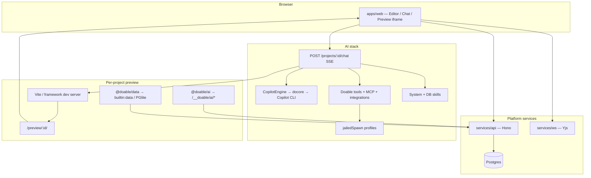

# Doable — Architecture & End-to-End Reference

Deep map of the codebase as it stands today: stack layout, how a prompt becomes a running app, every agent/mode, tools, skills, MCP servers, and known dual-stack gaps.

---

## 1. What Doable is

Doable is a **self-hosted AI app builder**. Teams describe an app in chat; Doable scaffolds a project, edits files via an AI coding agent, runs a live preview under sandbox profiles, and can publish to tenant hostnames — all on your infrastructure.

Core product loop:

1. Sign up → first user becomes **platform owner**
2. Setup wizard (AI provider / OAuth / optional Cloudflare / billing)
3. Create a project → chat in **agent / plan / chat / visual-edit** modes
4. AI writes code → Vite/Next preview at `/preview/:id/`
5. Optional publish to `*.yourdomain`

---

## 2. Monorepo map

```
doable/
├── apps/web/                 # Next.js UI (dashboard, editor, admin, setup)
├── services/api/             # Hono API — auth, projects, chat SSE, MCP, sandbox
├── services/ws/              # Yjs CRDT WebSocket (collab)
├── packages/
│   ├── shared/               # Types, provider catalog, secret resolver
│   ├── db/                   # Drizzle schema + migrations
│   ├── docore/               # Copilot SDK adapter + PolicyStore sandbox
│   ├── dovault/              # Config locks + sandbox backend registry
│   ├── doable-ai/            # Runtime SDK for *generated* apps (+ runMcpAgent)
│   ├── doable-data/          # Per-app PGlite client helpers
│   ├── doable-sdk/           # MCP client for apps (.mcp)
│   └── marketplace-bundle/   # Marketplace packaging
├── mcp-servers/              # Builtin MCP apps (pptx, pdf, xlsx, md, notebooklm, …)
├── doable-cli/               # Rust CLI (installer / doctor / admin)
├── deployment/               # Docker, VPS server-setup, k8s, fly
└── scripts/dev-local.sh      # No-root local bootstrap
```

| Layer | Tech | Default local ports |
|-------|------|---------------------|
| Web | Next.js | `http://127.0.0.1:3000` |
| API | Hono (Node) | `http://127.0.0.1:4000` |
| WS | Yjs | `ws://127.0.0.1:4001` |
| DB | Postgres 16 + pgvector | `127.0.0.1:5432` |

---

## 3. High-level runtime architecture



---

## 4. End-to-end: prompt → running app

### Phase A — Request

1. Editor calls `POST /projects/:id/chat` with `{ content, mode, model?, providerId?, attachments? }`  
   (`services/api/src/routes/chat/send-handler.ts`).
2. Gates: project access, AI enabled, credits, optional scaffold-on-create.
3. SSE stream opens. Client disconnect does **not** cancel generation (persists in background).

### Phase B — Project readiness

4. `scaffoldAndStartDev()`:
   - Unscaffolded → framework template + `npm install`
   - No dev server → start under **vite-preview** sandbox profile
5. Preview URL: `/preview/{projectId}/` (API reverse-proxies the jailed Vite process).

### Phase C — Model resolution

6. `resolveAiEngine()` (`engine-resolver.ts`) — priority chain:
   1. Admin enforcement
   2. Request body (`providerId` / `model` / Copilot account)
   3. User prefs
   4. Workspace defaults
   5. Platform defaults (plan tier)
   6. Self-heal from env / wizard
7. Production path always goes through **GitHub Copilot SDK** (BYOK Anthropic/OpenAI/Azure also via that SDK), not the legacy `AIEngine` loop.

### Phase D — Context, tools, skills

8. `buildProjectContextForMode()` — file tree, deps, `.doable/*` context, integrations manifest, progressive skills.
9. `buildSystemPrompt(mode, …)` — mode rules + framework prompt (`vite-react` / `nextjs-app`).
10. `createAllTools()` — Doable file/npm tools + connected integration actions + MCP tools.
11. `filterToolsForMode()` — plan allowlist / strip plan-only tools.
12. `materializeSkillsForSession()` — system `_system/*` dirs + DB skills → Copilot `skillDirectories`.

### Phase E — Copilot session

13. `resolveSession()` — resume `ai_sessions.copilot_session_id` or create via `CopilotEngine`.
14. Plan mode: `setSessionMode(..., "plan")` + SDK hook denylist for write tools.
15. `sendMessage()` streams SDK events; hooks normalize paths, deny dangerous bash writes, enforce inbuilt-DB rules.

### Phase F — UI + disk

16. Events mapped to SSE (`thinking`, `text_delta`, `tool_call`, `tool_result`, `code_diff`, `plan`, clarifications, MCP UI).
17. File tools write the project tree → Vite HMR → preview updates.
18. Post-processing: auto-fix preview errors, snapshots, memory, usage/traces.

### Phase G — Generated-app runtime (separate agent)

Inside the user’s app:

- `@doable/ai` talks to `/__doable/ai/chat` (platform-proxied model)
- `@doable/data` + `builtin:data` MCP → per-project PGlite
- `runMcpAgent()` — **client-side ReAct** loop over MCP tools (not the editor coding agent)

---

## 5. Agents & modes (complete inventory)

There are **two different “agents”** people confuse:

| Agent | Where it runs | Job |
|-------|---------------|-----|
| **Editor coding agent** | Server — Copilot SDK via `docore` | Builds/edits the project from chat |
| **`runMcpAgent`** | Browser / generated app — `@doable/ai` | ReAct loop calling MCP tools inside the app |

### 5.1 Editor modes (`AiMode` + visual-edit)

| Mode | Session key | Behavior | Maturity |
|------|-------------|----------|----------|
| **agent** | `projectId` | Full builder: files, npm, integrations, MCP, preview | **Production** |
| **plan** | `projectId` | Analyze, clarify, emit structured plan; write tools denied | **Production** |
| **chat** | `projectId` | Prompt says “answer only”; production tool filter is **not** fully read-only | **Partial mismatch** |
| **visual-edit** | `projectId:visual-edit` | Surgical `edit_file` from DOM selection in preview iframe | **Production** |

Copilot SDK also has native session modes (`interactive` / `plan` / `autopilot`) via `CopilotEngine.setSessionMode()`. Doable **plan** maps to SDK `plan`; **autopilot** is exposed in the engine API but not a first-class UI mode.

### 5.2 Legacy engine (orphaned from chat)

| Component | Path | Status |
|-----------|------|--------|
| `AIEngine` | `services/api/src/ai/engine.ts` | Implemented; **not** used by `POST …/chat` |
| Mode handlers | `ai/modes/agent.ts`, `plan.ts`, inline chat in `engine.ts` | Legacy only |
| `AnthropicProvider` | `ai/providers/anthropic.ts` | Direct HTTP; chat uses Copilot SDK BYOK instead |
| Legacy `ai/tools/*` | create/edit/delete/read/list/search/run_build/plan tools | Parallel registry; chat uses `copilot-tools.ts` |

**Authoritative production path:**

```
send-handler → CopilotEngine → DoCorePool → Copilot CLI
             → createAllTools (copilot-tools + MCP + integrations)
             → docore PolicyStore permission handler
```

---

## 6. Production tools

Defined in `services/api/src/ai/providers/copilot-tools.ts` (+ loaders).

| Tool | Purpose |
|------|---------|
| `create_file` | Create/overwrite; syntax + framework + dovault config guards |
| `edit_file` | Full-file replace with same guards |
| `read_file` | Read project files |
| `list_files` | Tree listing (skips node_modules/.git/dist) |
| `install_package` | `npm install --include=dev`; restarts preview |
| `deploy_preview` | Returns live preview URL |
| `ask_clarification` | Plan: up to 4 structured questions |
| `create_plan` | Plan: structured plan + `.doable/plan.md` |
| `mark_step_complete` | Plan step bookkeeping |
| `provision_supabase` | SSE hint → frontend provisioning UI |
| `run_supabase_migration` | DDL against connected Supabase |
| `request_integration` | SSE hint to connect an integration |
| `bash` | Doable-owned; runs via `jailedSpawn` (`ai-bash` profile) |

**Also injected when relevant:**

- Native integration actions (`integrations/tool-bridge.ts`) — one tool per connected Activepieces/curated action
- MCP tools as `mcp_<connector>_<tool>` (`mcp/tool-bridge.ts`)
- `mcp_discover_tools` when the MCP catalog is huge (>100 tools)

SDK built-ins (`view`, `grep`, `glob`, …) are gated by plan/agent hooks.

---

## 7. Skills

Skills are Copilot SDK folders with `SKILL.md`. The model selects them by matching frontmatter `description` keywords (or explicit `/skill-name`).

### 7.1 System / master skills (always available)

Path: `services/api/src/ai/skills/_system/<slug>/SKILL.md`  
Loader: `system-skills.ts` → prepended by `skills-materializer.ts`

| Slug | Intent |
|------|--------|
| `inbuilt-database` | Per-app PGlite + `data.*` MCP |
| `ecommerce-website` | Storefront / cart / checkout patterns |
| `resume-cv` | Resume/CV builder |
| `newsletter-template` | Newsletter layouts |
| `remotion-video-creation` | Programmatic video (+ references) |
| `event-invite-maker` | Event invites |
| `greeting-card` | Greeting / e-cards |
| `magazine-flipbook` | Flipbook UX |
| `business-card-maker` | Business cards |
| `competitor-analysis` | Competitive analysis apps |
| `ai-testing` | AI-assisted testing patterns |

Drop a raw `*.md` into `_system/` and it is auto-absorbed into `<slug>/SKILL.md`.

### 7.2 Framework guidance

| Framework | Where |
|-----------|--------|
| vite-react | `framework-prompts/vite-react.ts` + `skills/vite-react/*.md` |
| nextjs-app | `framework-prompts/nextjs-app.ts` + `skills/nextjs-app/*.md` |

### 7.3 Workspace / project / user skills (DB)

Tables `context_skills` / `context_skill_files` → materialized under `$DOABLE_SKILLS_DIR/<workspaceId>/…`.

---

## 8. MCP servers

### 8.1 Builtin workspace apps (`BUILTIN_MCP_APPS`)

| ID | Package | Role |
|----|---------|------|
| `presentation-builder@1` | `mcp-servers/presentation-builder` | Slide decks |
| `spreadsheet-builder@1` | `mcp-servers/spreadsheet-builder` | XLSX / CSV |
| `markdown-builder@1` | `mcp-servers/markdown-builder` | Markdown + HTML preview |
| `pdf-builder@1` | `mcp-servers/pdf-builder` | HTML → PDF |
| `notebooklm@1` | `mcp-servers/notebooklm` | Notebook / YouTube summaries |

`mcp-servers/image-generator/` exists in-repo but is **not** auto-provisioned with the builtins.

### 8.2 In-process builtin

| Command | Tools |
|---------|--------|
| `builtin:data` | `data.query`, `data.exec`, `data.migrate`, `data.schema`, `data.inspect` |

Registered per project when `DOABLE_APP_DB_ENABLED !== "0"`.

### 8.3 User / workspace connectors

- DB: `mcp_connectors`
- Transports: stdio, HTTP, `builtin:` short-circuit
- Virtual MCP: Supabase preset from OAuth
- App iframes call tools via `POST /projects/:id/chat/mcp-call`

---

## 9. Package roles (AI-related)

| Package | Role |
|---------|------|
| **`docore`** | Wraps `@github/copilot-sdk`: session pool, event bus, `PolicyStore`, isolation backends |
| **`dovault`** | Locks framework config files from AI overwrite; sandbox backend registry |
| **`@doable/ai`** | Generated-app chat/embed client + `runMcpAgent` + thinking-tag strippers |
| **`@doable/data`** | Per-app DB client |
| **`@doable/sdk`** | MCP client from inside generated apps |
| **`@doable/shared`** | `AiMode`, stream event types, provider catalog |

### What `docore` does for agents

1. `DoCoreEngine` — create/resume Copilot sessions; normalize SDK events  
2. `DoCorePool` — share Copilot CLI clients (pool size 1 in current chat path)  
3. `createPolicySandbox` — gate every read/write/shell/url/mcp/custom-tool  
4. `PolicyStore` — mutable allowlists / rate limits  

`DoCoreUserManager` is initialized but chat currently uses **per-project** `CopilotEngineManager` pools — multi-tenant user pooling is prepared, not hot-path yet.

---

## 10. Sandbox model

Layered isolation (production VPS); **local no-root disables jailing**:

| Layer | Mechanism |
|-------|-----------|
| AI permission gate | docore `PolicyStore` |
| AI bash | `sandbox/orchestrator` → `jailedSpawn` profile `ai-bash` |
| Dev server / npm | profiles `vite-preview`, `install`, `build` |
| Config protection | dovault `ConfigGuard` |
| Path rewrite | Copilot `onPreToolUse` (`/app/` → project root) |

**Local / Docker defaults (no root):**

```bash
DOABLE_HARDENING=off
DOABLE_HARDENING_LEVEL=off
DOABLE_DEV_UID_DISABLED=1
```

Docker compose also runs with hardening off. Full bubblewrap / AppArmor / UID drop is for `deployment/server-setup.sh` on a VPS.

---

## 11. Context files (`.doable/`)

Typical project context (types in `@doable/shared`):

- `identity.md`, `soul.md`, `memory.md`, `plan.md`, `agents.md`, …

Injected into the coding agent prompt via `context-builder` / context manager. Plan mode writes `.doable/plan.md`.

---

## 12. Where the product stands (maturity)

### Production-grade

- SSE chat with resume, background completion, tracing, credits  
- Copilot SDK sessions + BYOK + Copilot auth  
- File tools with validation + config locks  
- Plan mode + visual-edit mode  
- MCP builtins + `builtin:data` + user connectors  
- System + DB skills  
- Auto scaffold + preview proxy  
- Runtime AI/data proxies for generated apps  
- Large integration catalog (tools live only when connected)  
- Multi-tenant self-host (Docker / VPS / k8s / PaaS manifests)

### Dual-stack / gaps

| Area | Status |
|------|--------|
| Legacy `AIEngine` + `ai/tools/*` | Alive in tree, **orphaned** from chat |
| `chat` mode tools | Prompt read-only; production filter still exposes most tools |
| `delete_file` / `search_files` / `run_build` | In legacy tools only |
| `DoCoreUserManager` | Init’d; not on chat hot path |
| SDK `autopilot` | API-level; not a Doable UI mode |
| `image-generator` MCP | In repo, not auto-builtin |
| Root `.env.example` | Was gitignored — fixed for no-root local setup |

---

## 13. Local development (no root)

Preferred path — see also `scripts/dev-local.sh` and `.env.example`:

```bash
# Node 22 via nvm (avoid Cursor-bundled node on PATH)
export PATH="$HOME/.nvm/versions/node/v22.23.1/bin:$PATH"
corepack enable && corepack prepare pnpm@9.15.4 --activate

./scripts/dev-local.sh   # Postgres in Docker + .env + migrate
pnpm dev                 # web :3000, api :4000, ws :4001
```

Requirements: Docker (user in `docker` group — **not** sudo), Node 22, pnpm 9.  
**Do not switch the monorepo to Bun** — lockfile and workspace are pnpm/turbo-specific.

`dev-local.sh` sets `DOABLE_SKIP_BROWSERS=1` so `pnpm install` does **not** download Puppeteer/Playwright Chromium (~300MB+). NotebookLM / PDF thumbnail features need browsers later:

```bash
DOABLE_SKIP_BROWSERS=0 pnpm --filter notebooklm-mcp-server install
# or: cd mcp-servers/notebooklm/server && npx playwright install chromium
```

Alternative one-command demo (still no sudo if Docker is installed):

```bash
./deployment/docker/setup.sh
# → https://localhost
```

Production VPS (`deployment/server-setup.sh`) **does** need root (users, AppArmor, sudoers, systemd).

---

## 14. Key file index

```
services/api/src/routes/chat/send-handler.ts   # SSE orchestrator
services/api/src/routes/chat/system-prompts.ts # Production mode prompts
services/api/src/routes/chat/session-manager.ts
services/api/src/ai/providers/copilot-engine.ts
services/api/src/ai/providers/copilot-tools.ts
services/api/src/ai/engine-resolver.ts
services/api/src/ai/docore-bridge.ts
services/api/src/ai/skills/_system/            # Master skills
services/api/src/mcp/builtin-connectors.ts
services/api/src/sandbox/orchestrator.ts
packages/docore/                               # Copilot + policy
packages/doable-ai/src/index.ts                # runMcpAgent
```

---

---

## 15. Full-stack runtime extension

UI generation remains production-grade. The **platform app runtime** is implemented as a sync-safe overlay:

| Capability | Status |
|------------|--------|
| Named Mustache SQL queries (`/__doable/queries`) | **Shipped** (`app-runtime/`) |
| Auto CRUD REST (`/__doable/api/v1`) | **Shipped** |
| Workflows + expanded SDK (`ctx.queries`, messages, users, rbac, …) | **Shipped** |
| Schedules / webhooks / topics / CDC | **Shipped** |
| `@doable/runtime` client + `_ext` skills + `builtin:runtime` | **Shipped** |
| Data templates (waitlist, saas-leads, todo-multi-tenant) | **Shipped** |

Enable by default (`DOABLE_APP_RUNTIME_ENABLED` unset or any value other than `0`). Spec: [`FULLSTACK_RUNTIME.md`](./FULLSTACK_RUNTIME.md). Hooks: [`FORK_EXTENSIONS.md`](./FORK_EXTENSIONS.md). While enabled, `create_file` / `edit_file` **reject** raw `db.query` / Express in app source — named queries via `@doable/runtime` are required.

---

*Generated from the current tree. When adding agents/skills/MCP apps, update this doc and the `_system` / `BUILTIN_MCP_APPS` inventories above.*
